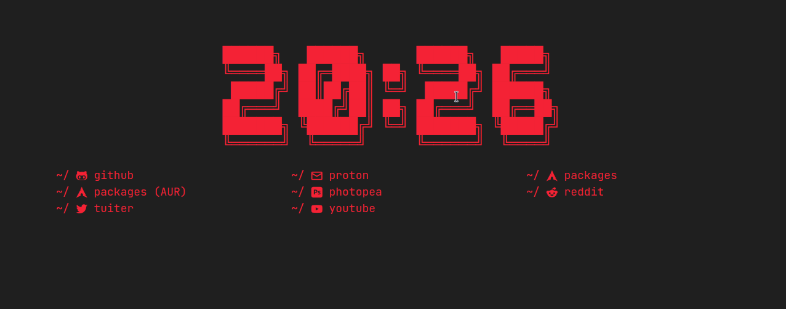

# HTML local en nueva pestaña para Chromium

extensión para Chromium que permite usar un HTML local para usar como nueva pestaña / homepage.

## Contents

- [instalación](#instalación)
- [personalizar página](#personalizar-página)
- [detalles técnicos](#detalles-técnicos)
- [repo original](#repo-original)

## instalación

1. [descarga](https://github.com/mardevour/custom-new-tab/archive/refs/heads/main.zip) este repositorio
2. abre `chromium://extensions` (sustituye `chromium` por el nombre de tu navegador chromium, por ejemplo: `chrome://extensions`, `brave://extensions`...) en tu navegador, activa el Modo Desarrollador con el interruptor arriba a la derecha
3. haz click en el botón "Cargar descomprimida"
4. selecciona la carpeta descomprimida

## personalizar página

simplemente modifica la página en `/dist/index.html`, el estilo en `/dist/css/style.css` y el js en `/dist/js/` :)

## detalles técnicos

usa:

- Node 16
- TailwindCSS

## repo original

repo original por:

- Matt Fields - hello@mattfields.dev
- https://github.com/fieldse/custom-chrome-new-tab-page
